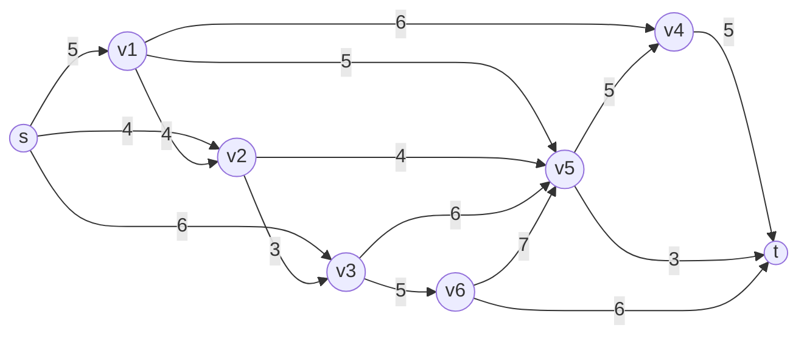

# Max Flow Problem Model

*   A natural gas producer *s* needs to send the maximum amount of gas to factory *t* through pipelines.
*   Each pipeline *ij* is directed (gas passes only in one direction) and has an associated capacity.

#### Graph Representation (Mermaid)

## 1. Decision Variables $(x_j)$

$$
x_{ij} = \text{flow of gas from node } i \text{ to node } j \quad \forall (i, j) \in A
$$

## 2. Objective Function

$$
\max \sum_{i \in N(t)} x_{i,t} \quad \text{(maximize flow from source 's' to sink 't')}
$$

## 3. Constraints

1. Non-negativity: $x_{ij} \geq 0 \quad \forall (i, j) \in A$

2. Capacity constraints: $x_{ij} \leq u_{ij} \quad \forall (i, j) \in A$

3. Flow conservation: 

$$
\sum_{j} x_{ij} = \sum_{j} x_{ji} \quad \forall i \in V \setminus \{s, t\} \\

(\text{flow into node } i \text{ equals flow out of node } i)
$$

